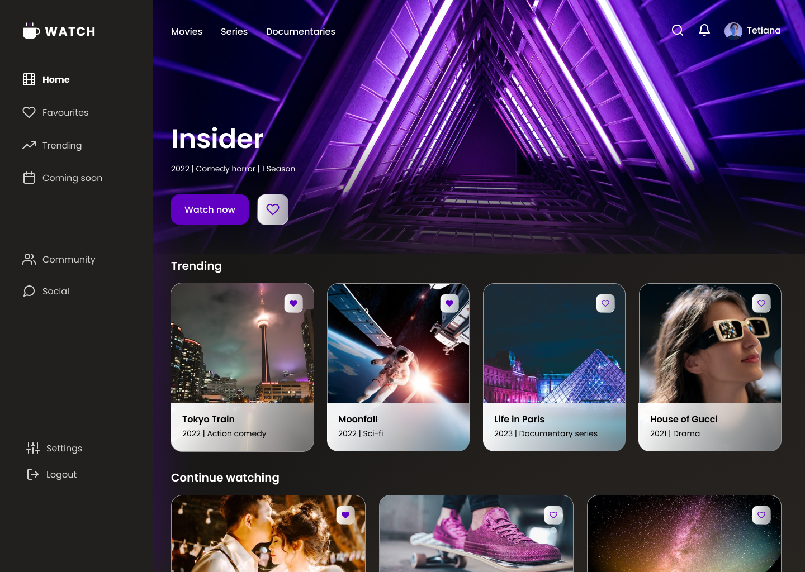

# Movie-Streaming-Web-App
Recriação de um layout de um site de streaming baseado no projeto do figma

## Objetivo
Utilezei como base um projeto do figma que encontrei na web para treinar HTML e CSS. A ideia é recriar o layout igual ao projeto do figma.

Abaixo o layout que utilizei para a pagina inicial.

## Layout recriado 

